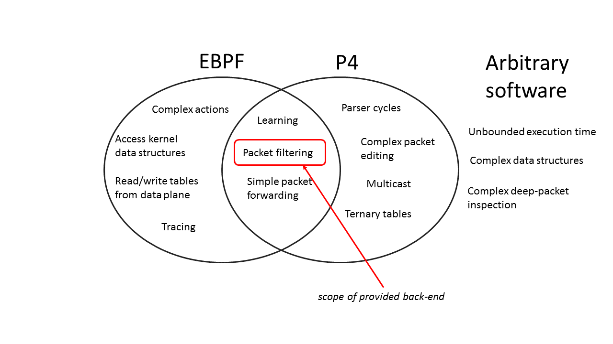

# eBPF Backend

The back-end accepts only P4_16 code written for the `ebpf_model.p4`
filter model.  It generates C code that can be afterwards compiled
into eBPF (extended Berkeley Packet Filters
https://en.wikipedia.org/wiki/Berkeley_Packet_Filter) using clang/llvm
or bcc (https://github.com/iovisor/bcc.git).

An older version of this compiler for compiling P4_14 is available at
https://github.com/iovisor/bcc/tree/master/src/cc/frontends/p4

Identifiers starting with ebpf_ are reserved in P4 programs, including
for structure field names.

## Background

In this section we give a brief overview of P4 and EBPF.  A detailed
treatment of these topics is outside the scope of this text.

### P4

[P4] (http://p4.org) is a domain-specific programming language for
specifying the behavior of the dataplanes of network-forwarding
elements.  The name of the programming language comes from the title
of a paper published in the proceedings of SIGCOMM Computer
Communications Review in 2014:
[Programming Protocol-Independent Packet Processors](http://www.sigcomm.org/ccr/papers/2014/July/0000000.0000004)

P4 itself is protocol-independent but allows programmers to express a
rich set of data plane behaviors and protocols.  This back-end only
supports the newest version of the P4 programming language,
[P4_16](http://p4.org/wp-content/uploads/2016/12/P4_16-prerelease-Dec_16.html). The core P4 abstractions are:

* Headers describe the format (the set of fields and their
  sizes) of each header within a packet.

* Parser (finite-state machines) describe the permitted header
  sequences within received packets.

* Tables associate keys to actions. P4 tables generalize traditional
  forwarding tables; they can be used to implement routing tables,
  flow lookup tables, access-control lists, etc.

* Actions describe how packet header fields and metadata are manipulated.

* Match-action units stitch together tables and actions, and perform
  the following sequence of operations:

  * Construct lookup keys from packet fields or computed metadata,

  * Use the constructed lookup key to index into tables, choosing an
  action to execute,

  * Finally, execute the selected action.

* Control flow is expressed as an imperative program describing the
  data-dependent packet processing within a pipeline, including the
  data-dependent sequence of match-action unit invocations.

P4 programs describe the behavior of network-processing dataplanes.  A
P4 program is designed to operate in concert with a separate *control
plane* program.  The control plane is responsible for managing at
runtime the contents of the P4 tables.  P4 cannot be used to specify
control-planes; however, a P4 program implicitly specifies the
interface between the data-plane and the control-plane.

### eBPF

#### Safe code

eBPF is a acronym that stands for Extended Berkeley Packet Filters.
In essence eBPF is a low-level programming language (similar to
machine code); eBPF programs are traditionally executed by a virtual
machine that resides in the Linux kernel.  eBPF programs can be
inserted and removed from a live kernel using dynamic code
instrumentation.  The main feature of eBPF programs is their *static
safety*: prior to execution all eBPF programs have to be validated as
being safe, and unsafe programs cannot be executed.  A safe program
provably cannot compromise the machine it is running on:

* it can only access a restricted memory region (on the local stack)

* it can run only for a limited amount of time; during execution it
  cannot block, sleep or take any locks

* it cannot use any kernel resources with the exception of a limited
  set of kernel services which have been specifically whitelisted,
  including operations to manipulate tables (described below)

#### Kernel hooks

eBPF programs are inserted into the kernel using *hooks*.  There are
several types of hooks available:

* any function entry point in the kernel can act as a hook; attaching
  an eBPF program to a function `foo()` will cause the eBPF program to
  execute every time some kernel thread executes `foo()`.

* eBPF programs can also be attached using the Linux Traffic Control
  (TC) subsystem, in the network packet processing datapath.  Such
  programs can be used as TC classifiers and actions.

* eBPF programs can also be attached to sockets or network interfaces.
  In this case they can be used for processing packets that flow
  through the socket/interface.

eBPF programs can be used for many purposes; the main use cases are
dynamic tracing and monitoring, and packet processing.  We are mostly
interested in the latter use case in this document.

#### eBPF Tables

The eBPF runtime exposes a bi-directional kernel-userspace data
communication channel, called *tables* (also called maps in some eBPF
documents and code samples).  eBPF tables are essentially key-value
stores, where keys and values are arbitrary fixed-size bitstrings.
The key width, value width and table size (maximum number of entries
that can be stored) are declared statically, at table creation time.

In user-space tables handles are exposed as file descriptors.  Both
user- and kernel-space programs can manipulate tables, by inserting,
deleting, looking up, modifying, and enumerating entries in a table.

In kernel space the keys and values are exposed as pointers to the raw
underlying data stored in the table, whereas in user-space the
pointers point to copies of the data.

#### Concurrency

An important aspect to understand related to eBPF is the execution
model.  An eBPF program is triggered by a kernel hook; multiple
instances of the same kernel hook can be running simultaneously on
different cores.

Each table however has a single instances across all the cores.  A
single table may be accessed simultaneously by multiple instances of
the same eBPF program running as separate kernel threads on different
cores.  eBPF tables are native kernel objects, and access to the table
contents is protected using the kernel RCU mechanism.  This makes
access to table entries safe under concurrent execution; for example,
the memory associated to a value cannot be accidentally freed while an
eBPF program holds a pointer to the respective value.  However,
accessing tables is prone to data races; since eBPF programs cannot
use locks, some of these races often cannot be avoided.

eBPF and the associated tools are also under active development, and
new capabilities are added frequently.

## Compiling P4 to eBPF

From the above description it is apparent that the P4 and eBPF
programming languages have different expressive powers.  However,
there is a significant overlap in their capabilities, in particular,
in the domain of network packet processing.  The following image
illustrates the situation:



We expect that the overlapping region will grow in size as both P4 and
eBPF continue to mature.

The current version of the P4 to eBPF compiler translates programs
written in the version P4_16 of the programming language to programs
written in a restricted subset of C.  The subset of C is chosen such
that it should be compilable to eBPF using clang and/or bcc (the BPF
Compiler Collection -- https://github.com/iovisor/bcc).

```
         --------------              -------
P4 --->  | P4-to-eBPF | ---> C ----> | clang/BCC | --> eBPF
         --------------              -------
```

The P4 program only describes the packet processing *data plane*, that
runs in the Linux kernel.  The *control plane* must be separately
implemented by the user. BCC tools simplify this task
considerably, by generating C and/or Python APIs that expose the
dataplane/control-plane APIs.

### Dependencies

Our eBPF programs require a Linux kernel with version 4.15 or newer.
In addition the following packages and programs are required to run the full test suite:

- Clang 3.3 and llvm 3.7.1 or later are required. (Note: In some
  versions of Ubuntu Xenial (16.04.4) CMake crashes when checking for
  llvm. Until the bugfix is committed upstream, workarounds are
  available in the following issue:
  https://github.com/p4lang/p4c/issues/1376

- libpcap-dev to parse and generate .pcap files.

- libelf-dev to compile C-programs to eBPF byte code.

- iproute2 to use tc/ip commands to load eBPF programs.

- net-tools (if not installed already)

Additionally, the eBPF compiler test suite has the following python dependencies:

- The python iproute2 package to create virtual interfaces.

- The python ply package to parse .stf testing files.

- The python scapy package to read and write pcap files.

You can install these using:
```
$ sudo apt-get install clang llvm libpcap-dev libelf-dev iproute2 net-tools
$ sudo pip install pyroute2 ply scapy==2.4.0
```

### Supported capabilities

The current version of the P4 to eBPF compiler supports a relatively
narrow subset of the P4 language, but still powerful enough to write
very complex packet filters and simple packet forwarding engines.  We expect
that the compiler's capabilities will improve gradually.

Here are some limitations imposed on the P4 programs:

* this architecture only supports packet filters: the control block
  returns a boolean value which indicates whether a packet is
  forwarded or dropped

* arbitrary parsers can be compiled, but the BCC compiler will reject
  parsers that contain cycles

* arithmetic on data wider than 32 bits is not supported

* eBPF does not offer support for ternary table matches

### Translating P4 to C

To simplify the translation, the P4 programmer should refrain using
identifiers whose name starts with `ebpf_`.

The following table provides a brief summary of how each P4 construct
is mapped to a corresponding C construct:

#### Translating parsers

P4 Construct | C Translation
----------|------------
`header`  | `struct` type with an additional `valid` bit
`struct`  | `struct`
parser state  | code block
state transition | `goto` statement
`extract` | load/shift/mask data from packet buffer

#### Translating match-action pipelines
##
P4 Construct | C Translation
----------|------------
table     | 2 eBPF tables: second one used just for the default action
table key | `struct` type
table `actions` block | tagged `union` with all possible actions
`action` arguments | `struct`
table `reads` | eBPF table access
`action` body | code block
table `apply` | `switch` statement
counters  | additional eBPF table

#### Generating code from a .p4 file
The C code can be generated using the following command:

`p4c-ebpf PROGRAM.p4 -o out.c`

This will generate the C-file and its corresponding header.

#### Using the generated code

The resulting file contains the complete data structures, tables, and
a C function named `ebpf_filter` that implements the P4-specified
data-plane.  This C file can be manipulated using clang or BCC tools;
please refer to the BCC project documentation and sample test files of
the P4 to eBPF source code for an in-depth understanding.

The general C-file alone will not compile. It depends on headers
specific to the generated target. For the default target, this is the
`kernel_ebpf.h` file which can be found in the P4 backend under
`p4c/backends/ebpf/runtime`.  The P4 backend also provides a makefile
and sample header which allow for quick generation and automatic
compilation of the generated file.

`make -f p4c/backends/ebpf/runtime/kernel.mk BPFOBJ=out.o P4FILE=PROGRAM.p4`

where -f path is the path to the makefile, BPFOBJ is the output ebpf
byte code and P4FILE is the input P4 program. This command sequence
will generate an eBPF program, which can be loaded into the kernel
using TC.

##### Connecting the generated program with the TC

The eBPF code that is generated is can be used as a classifier
attached to the ingress packet path using the Linux TC subsystem.  The
same eBPF code should be attached to all interfaces.  Note however
that all eBPF code instances share a single set of tables, which are
used to control the program behavior.

`tc qdisc add dev IFACE clsact`

Creates a classifier qdisc on the respective interface. Once created,
eBPF programs can be attached to it using the following command:

`tc filter add dev IFACE egress bpf da obj YOUREBPFCODE section prog verbose`

`da` implies that tc takes action input directly from the return codes
provided by the eBPF program. We currently support `TC_ACT_SHOT` and
`TC_ACT_OK`. For more information, see this link:

http://docs.cilium.io/en/latest/bpf/#tc-traffic-control

# How to run the generated eBPF program

Once the eBPF program is loaded, various methods exist to manipulate
the tables. The easiest and simplest way is to use the
[bpftool](http://docs.cilium.io/en/latest/bpf/#bpftool) provided by
the kernel.

An alternative is to use explicit syscalls (an example can be found in
the [kernel tools
folder](https://github.com/torvalds/linux/blob/master/tools/lib/bpf/bpf.c).

The P4 compiler automatically provides a set of table initializers,
which may also serve as example, in the header of the generated
C-file.

The following tests run ebpf programs:

- `make check-ebpf`: runs the basic ebpf user-space tests
- `make check-ebpf-bcc`: runs the user-space tests using bcc to compile ebpf
- `sudo make check-ebpf-kernel`: runs the kernel-level tests.
   Requires root privileges to install the ebpf program in the Linux kernel.
