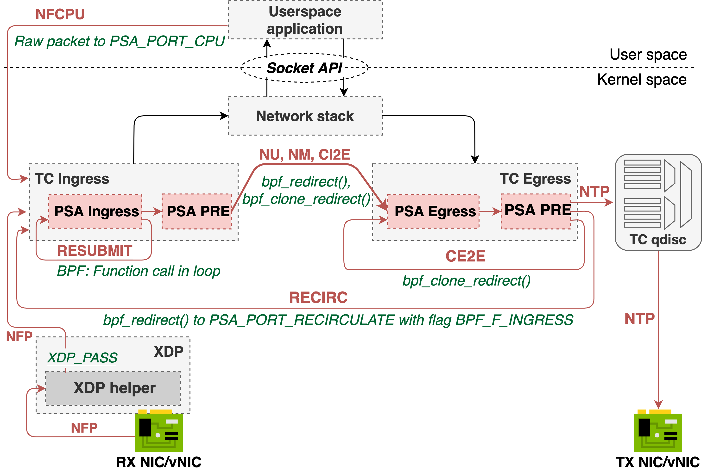

# PSA implementation for eBPF backend

This directory implements PSA (Portable Switch Architecture) for the eBPF backend.

# Prerequisites

- Refer to the [Cilium docs](https://docs.cilium.io/en/latest/bpf/) to learn more about eBPF.
- This guide assumes at least basic familiarity with [the PSA specification](https://p4.org/p4-spec/docs/PSA.html).
- The PSA implementation inherits some mechanisms (e.g. generation of Parser and Control block) from `ebpf_model`. Please, get familiar with
[the base eBPF backend](../README.md) first.

# Design

P4 packet processing is translated into a set of eBPF programs attached to the TC hook. The eBPF programs implement packet processing defined
in a P4 program written according to the PSA model. The TC hook is used as a main engine, because it enables a full implementation of the PSA specification.
We also plan to contribute the XDP-based version of the PSA implementation that does not implement the full specification, but provides better performance.

The TC-based design of PSA for eBPF is depicted in Figure below.



- `xdp-helper` - the fixed, non-programmable "helper" program attached to the XDP hook. The role of the `xdp-helper` program is to prepare
  a packet for further processing in the TC subsystem. Why do we need the XDP helper program? Some eBPF helpers for the TC hook depend on
  the `skb->protocol` type (in particular, IPv4/IPv6 EtherType), which is read by the TC layer before a packet enters the eBPF program.
  This limitation prevents from using TC as a protocol-independent packet processing engine. If a packet arriving at the XDP level isn't
  an IPv4 packet, the XDP helper replaces it's original EtherType with IPv4 EtherType. The original EtherType is passed to TC according to 
  the XDP2TC mode specified by a user (see XDP2TC metadata section). The `tc-ingress` program reads original EtherType and puts it back into the packet. 
  We verified that this workaround enables handling other protocols in the TC layer (e.g., MPLS).
- `tc-ingress` - In the TC Ingress, the PSA Ingress pipeline as well as so-called "Traffic Manager" eBPF program is attached.
  The Ingress pipeline is composed of Parser, Control block and Deparser. The details of Parser, Control block and Deparser implementation
  will be explained further in this document. The same eBPF program in TC contains also the Traffic Manager.
  The role of Traffic Manager is to redirect traffic between the Ingress (TC) and Egress (TC).
  It is also responsible for packet replication via clone sessions or multicast groups and sending packet to CPU.
- `tc-egress` - The PSA Egress pipeline (composed of Parser, Control block and Deparser) is attached to the TC Egress hook. As there is no
  XDP hook in the Egress path, the use of TC is mandatory for the egress processing. **Note!** If the PSA Egress pipeline is not used (i.e. it is left empty by a developer),
  the PSA-eBPF compiler will not generate the TC Egress program. This brings a noticeable performance gain, if the egress pipeline is not used. 
  
## Packet paths

### NFP (Normal Packet From Port)

Packet arriving on an interface is intercepted in the XDP hook by the `xdp-helper` program. It performs pre-processing and
packet is passed for further processing to the TC ingress. Note that there is no P4-related processing done in the `xdp-helper` program.

By default, a packet is further passed to the TC subsystem. It is done by `XDP_PASS` action and packet is further handled by `tc-ingress` program.

### RESUBMIT

The purpose of `RESUBMIT` is to transfer packet processing back to the Ingress Parser from Ingress Deparser.

We implement packet resubmission by calling main `ingress()` function (implementing the PSA Ingress pipeline) in a loop. 
The `MAX_RESUBMIT_DEPTH` variable specifies maximum number of resubmit operations (the `MAX_RESUBMIT_DEPTH` value is currently hardcoded and is set to 4).
The `resubmit` flag defines whether the `tc-ingress` program should enter next iteration (resubmit)
or break the loop. The pseudocode looks as follows:

```c
int i = 0;
int ret = TC_ACT_UNSPEC;
for (i = 0; i < MAX_RESUBMIT_DEPTH; i++) {
    out_md.resubmit = 0;
    ret = ingress(skb, &out_md);
    if (out_md.resubmit == 0) {
        break;
    }
}
```

### NU (Normal Unicast), NM (Normal Multicast), CI2E (Clone Ingress to Egress)

NU, NM and CI2E refer to process of sending packet from the PSA Ingress Pipeline (more specifically from the Traffic Manager)
to the PSA Egress pipeline. The NU path is implemented in the eBPF subsystem by invoking the `bpf_redirect()` helper from
the `tc-ingress` program. This helper sets an output port for a packet and the packet is further intercepted by the TC egress.

Both NM and CI2E require the `bpf_clone_redirect()` helper to be used. It redirects a packet to an output port, but also
clones a packet buffer, so that a packet can be copied and sent to multiple interfaces. From the eBPF program's perspective, 
`bpf_clone_redirect()` must be invoked in the loop to send packets to all ports from a clone session/multicast group.

Clone sessions or multicast groups and theirs members are stored as a BPF array map of maps (`BPF_MAP_TYPE_ARRAY_OF_MAPS`). 
The P4-eBPF compiler generates two outer BPF maps: `multicast_grp_tbl` and `clone_session_tbl`. Both of them store inner maps indexed by 
the clone session or multicast group identifier, respectively. The clone session/multicast group members (defining `egress_port`, `instance` or other parameters used by clone sessions)
are stored in the inner hash map. 

While performing the packet replication, the eBPF program does a lookup to the outer map based on the clone session/multicast group identifier and, then,
does another lookup to the inner map to find all members.

### CE2E (Clone Egress to Egress)

CE2E refers to process of copying a packet that was handled by the Egress pipeline and resubmitting the cloned packet to the Egress Parser.

CE2E is implemented by invoking `bpf_clone_redirect()` helper in the Egress path. Output ports are determined based on the
`clone_session_id` and lookup to "clone_session" BPF map, which is shared among TC ingress and egress (eBPF subsystem allows for map sharing between programs).

### Sending packet to CPU

The PSA implementation for eBPF backend assumes a special interface called `PSA_PORT_CPU` that is used for communication between
a control plane application and data plane. Sending packet to CPU does not differ significantly from normal packet unicast. 
A control plane application should listen for new packets on the interface identified by `PSA_PORT_CPU` in a P4 program. 
By redirecting a packet to `PSA_PORT_CPU` in the Ingress pipeline the packet is forwarded via Traffic Manager to the Egress pipeline and then, sent to the "CPU" interface.

### NTP (Normal packet to port)

Packets from `tc-egress` are sent out to the egress port. The egress port is determined in the Ingress pipeline and is not changed in the Egress pipeline.

Note that before a packet is sent to the output port, it's processed by `TC qdisc` first. The `TC qdisc` is the Linux QoS engine. 
The eBPF programs generated by P4-eBPF compiler sets `skb->priority` value based on the PSA `class_of_service` metadata. 
The `skb->priority` is used to interact between eBPF programs and `TC qdisc`. A user can configure different QoS behaviors via TC CLI and 
send a packet from PSA pipeline to a specific QoS class identified by `skb->priority`. 

### RECIRCULATE

The purpose of `RECIRCULATE` is to transfer packet processing back from the Egress Deparser to the Ingress Parser.

In order to implement `RECIRCULATE` we assume the existence of `PSA_PORT_RECIRCULATE` ports. Therefore, packet recirculation is simply performed by
invoking `bpf_redirect()` to the `PSA_PORT_RECIRCULATE` port with `BPF_F_INGRESS` flag to enforce processing a packet by the Ingress pipeline.

## Metadata

There are some global metadata defined for the PSA architecture. For example, `packet_path` must be shared among different pipelines.
To share a global metadata between pipelines we use `skb->cb` (control buffer), which gives us 20B that are free to use.

## XDP2TC mode

The XDP2TC mode determines how the metadata (containing original EtherType) is passed from XDP up to TC.
By default, PSA-eBPF uses the `bpf_xdp_adjust_meta()` helper to append the original
EtherType to the `skb`’s `data_meta` field, which is further read by the TC Ingress to restore the original format of the packet.
The way of passing metadata is determined by the user-configurable `--xdp2tc` compiler flag. We have noticed that some NIC
drivers does not support the `bpf_xdp_adjust_meta()` BPF helper and the default mode cannot be used. Therefore, we
come up with a more generic mode called `head`, which uses `bpf_xdp_adjust_head()` instead to prepend a packet with
metadata. In this mode, the helper must be invoked twice - in the XDP helper program to append the metadata and in
the TC Ingress to strip the metadata out of a packet. We also introduce the third mode - `cpumap`, which is an experimental features and should be used carefully.
The `cpumap` assumes that the single CPU core handles a packet in the run-to-completion mode from XDP up to the TC layer
(in other words, for a given packet, the CPU core running the TC program is the same as the one for XDP). If the above
condition is met, the `cpumap` mode uses the per-CPU BPF array map to transfer metadata from XDP to TC. Hence, the `cpumap` mode 
should only be used, if there is a guarantee that the same CPU core handles the packet in both XDP and TC hooks.
Note that the XDP helper program introduces a constant but noticeable per-packet overhead. Though, it is necessary to implement P4 processing in the TC layer.

To sum up, the `--xdp2tc` compiler flag can take the following values:
- `meta` (default) - uses the `bpf_xdp_adjust_meta()` BPF helper. It's the most efficient way and should be used wherever possible. 
- `head` - uses the `bpf_xdp_adjust_head()` BPF helper and should be used if `meta` is not supported by a NIC driver.
- `cpumap` - uses the BPF per-CPU array map. It should rather be used for testing purposes only. 

## Control-plane API

The PSA-eBPF compiler assumes that any control plane software managing eBPF programs generated by the 
P4 compiler must be in line with the Control-plane API (a kind of contract or set of instructions that must be followed
to make use of PSA-eBPF programs). The Control-plane API is summarized below, but we suggest using the [psabpf API](https://github.com/P4-Research/psabpf) that
already implements the control-plane API and exposes higher level C API. 

- **Pipeline initialization** - eBPF programs must be first loaded to the eBPF subsystem. The C files generated by the P4 compiler
are compatible with `libbpf` loader and are annotated with BTF. All eBPF objects (programs, maps) must be pinned to the BPF filesystem
under `/sys/fs/bpf/`. Once eBPF objects are loaded and pinned, a control plane application must invoke `map_initialize()` BPF function -
it can be done using `bpf_prog_test_run`. The `map_initialize()` function is auto-generated by the PSA-eBPF compiler
and configures all initial state, i.e. it initializes default actions, const entries, etc.
  
- **Table management** - a control plane software is responsible for inserting BPF map entries that 
are in line with types generated by the P4 compiler. The PSA-eBPF compiler generates C `struct` for BPF map's key and value.
(e.g. `ingress_tbl_fwd_key` and `ingress_tbl_fwd_value`). The `exact` match table is implemented as BPF hash map. 
The `lpm` match table is implemented as BPF `LPM_TRIE`. Both key and value fields must be provided in the host byte order. 

- **Clone sessions or multicast groups management** - Clone sessions or multicast groups are represented as a BPF array map of maps 
(`BPF_MAP_TYPE_ARRAY_OF_MAPS`) in the eBPF subsystem. Each entry of an outer map represents a single clone session or multicast group.
An inner map is a hash map storing clone session/multicast group members, according to the structure defined by
`struct list_key_t` (BPF map key) and `struct element` (value). To add a new clone session/mutlicast group, a control plane must add
a new element to the outer map (indexed by clone session or multicast group identifier referenced by `clone_session_id` 
or `multicast_group` in a PSA program) and initialize an inner map. To add a new clone session/multicast group member,
a con1trol plane must add new element to the inner map.

## P4 match kinds

The PSA-eBPF compiler currently supports the following P4 match kinds: `exact`, `lpm`, `ternary`.

### exact

An `exact` table is implemented using the BPF hash map. A P4 table is considered an `exact` table if all its match fields are defined as `exact`.
Then, the PSA-eBPF compiler generates a BPF hash map instance for each P4 table instance. The hash map key as a concatenation of P4 match fields translated to eBPF representation.
Each `apply()` operation is translated into a lookup to the BPF hash map. The value is used to determine an action and its parameters. 

### lpm

An `lpm` table is implemented using the BPF `LPM_TRIE` map. A P4 table is considered an `lpm` table if it contains a single `lpm` field and no `ternary` fields.
The PSA-eBPF compiler generates a BPF `LPM_TRIE` map instance for each P4 table instance. The hash map key as a concatenation of P4 match fields translated to eBPF representation.
Moreover, the PSA-eBPF compiler shuffles the match fields and places the `lpm` field in the last position. Each `apply()` operation is translated into a lookup to the `LPM_TRIE` map.
A control plane should populate the `LPM_TRIE` map with entries composed of a value and prefix. 

### ternary

There is no built-in BPF map for ternary (wildcard) matching. Hence, the PSA-eBPF compiler leverages the Tuple Space Search (TSS) algorithm for ternary matching (refer to the [research paper](https://dl.acm.org/doi/10.1145/316194.316216) to learn more about the TSS algorithm). 
A `ternary` table is implemented using a combination of hash and array BPF maps that realizes the TSS algorithm. A P4 table is considered a `ternary` table if it contains at least one `ternary` field (exact and lpm fields are converted to ternary fields with an appropriate mask). 

**Note!** The PSA-eBPF compiler requires match keys in a ternary table to be sorted by size in descending order.

The PSA-eBPF compiler generates 2 BPF maps for each ternary table instance (+ the default action map):
- the `<TBL-NAME>_prefixes` map is a BPF hash map that stores all unique ternary masks. The ternary masks are created based on the runtime table entries that are installed by a user.
- the `<TBL-NAME>_tuples_map` map is a BPF array map of maps that stores all "tuples". A single tuple is a BPF hash map that stores all flow rules with the same ternary mask. 

Note that the `psabpf-ctl table add` CLI command greatly simplifies the process of adding/removing flow rules to ternary tables. 

For each `apply()` operation, the PSA-eBPF compiler generates the piece of code performing lookup to the above maps. The lookup code iterates over the `<TBL-NAME>_prefixes` map to 
retrieve a ternary mask. Next, the lookup key (a concatenation of match keys) is masked with the obtained ternary mask and lookup to a corresponding tuple map is performed. 
If a match is found, the best match with the highest priority is saved, and the algorithm continues to examine other tuples. If an entry with a higher priority is found,
the best match is overwritten. The algorithm exists when there is no more tuples left.

The snippet below shows the C code generated by the PSA-eBPF compiler for a lookup into a ternary table. The steps are explained below.

```c
struct ingress_tbl_ternary_1_key key = {};
key.field0 = hdr->ipv4.dstAddr;
key.field1 = hdr->ipv4.diffserv;
struct ingress_tbl_ternary_1_value *value = NULL;
struct ingress_tbl_ternary_1_key_mask head = {0};
struct ingress_tbl_ternary_1_value_mask *val = BPF_MAP_LOOKUP_ELEM(ingress_tbl_ternary_1_prefixes, &head);
if (val && val->has_next != 0) {
    struct ingress_tbl_ternary_1_key_mask next = val->next_tuple_mask;
    #pragma clang loop unroll(disable)
    for (int i = 0; i < MAX_INGRESS_TBL_TERNARY_1_KEY_MASKS; i++) {  // (1)
        struct ingress_tbl_ternary_1_value_mask *v = BPF_MAP_LOOKUP_ELEM(ingress_tbl_ternary_1_prefixes, &next);
        if (!v) {
            break;
        }
        // (2)
        struct ingress_tbl_ternary_1_key k = {};
        __u32 *chunk = ((__u32 *) &k);
        __u32 *mask = ((__u32 *) &next);
        #pragma clang loop unroll(disable)
        for (int i = 0; i < sizeof(struct ingress_tbl_ternary_1_key_mask) / 4; i++) {
            chunk[i] = ((__u32 *) &key)[i] & mask[i];
        }
        __u32 tuple_id = v->tuple_id;
        next = v->next_tuple_mask;
        // (3)
        struct bpf_elf_map *tuple = BPF_MAP_LOOKUP_ELEM(ingress_tbl_ternary_1_tuples_map, &tuple_id);
        if (!tuple) {
            break;
        }
        
        // (4)
        struct ingress_tbl_ternary_1_value *tuple_entry = bpf_map_lookup_elem(tuple, &k);
        if (!tuple_entry) {
            if (v->has_next == 0) {
                break;
            }
            continue;
        }
        // (5)
        if (value == NULL || tuple_entry->priority > value->priority) {
            value = tuple_entry;
        }
        if (v->has_next == 0) {
            break;
        }
    }
}

// (6): go to default action if value == NULL
```

The description of annotated lines:
1. The algorithm starts to iterate over the ternary masks map. The loop is bounded by the `MAX_INGRESS_TBL_TERNARY_1_KEY_MASKS` which is configured by `--max-ternary-masks` compiler option (defaults to 128).
   Note that the eBPF program complexity (instruction count) depends on this constant, so some more complex P4 program may not compile if the max ternary masks value is too high (see the Limitations section).
2. A lookup key to a next tuple map is created by masking the concatenation of match keys with the ternary masks retrieved from the `<TBL-NAME>_prefixes` map. Note that the key is masked in 4-byte chunks.
3. A lookup to the `<TBL-NAME>_tuples_map` outer BPF map is done to find a tuple map based on the tuple ID. The lookup returns the inner BPF map, which stores all entries related to a tuple.
4. Next, a lookup to the inner BPF map (a tuple map) is performed. The returned value stores the action ID, action params and priority. 
5. The priority of an obtained value is compared with a current "best match" entry. An entry that is returned from the ternary classification is the one with the highest priority among different tuples.

Note that the TSS algorithm has linear O(n) packet classification complexity, where "n" is a number of unique ternary masks.

## PSA externs

### ActionProfile

[ActionProfile](https://p4.org/p4-spec/docs/PSA.html#sec-action-profile) is a table implementation that separates actions
(and its parameters) from a P4 table, introducing a level of indirection. The P4-eBPF compiler generates an additional
BPF hash map, if the Action Profile is specified for a P4 table. The additional BPF map stores the mapping between the
ActionProfile member reference and a P4 action specification. During the lookup to the P4 table with Action Profile, eBPF
program first queries the first BPF map using the match key composed from the packet fields and expects the ActionProfile
member reference to be returned. Next, the eBPF programs uses the obtained member reference as a lookup key to a second
map to retrieve the action specification. Hence, the eBPF program does one additional lookup to the additional BPF map,
if the ActionProfile is specified for a P4 table.

**Note:** As of April 2022, support for ActionProfile extern in `psabpf-ctl` CLI/API is not implemented yet. As a workaround
you can use `psabpf-ctl table` command for this extern.

### ActionSelector

[ActionSelector](https://p4.org/p4-spec/docs/PSA-v1.1.0.html#sec-action-selector) is a table implementation similar to
an ActionProfile, but extends its functionality with support for groups of actions. If a table entry contains a member
reference, the ActionSelector behaves in the same way as an ActionProfile. In case of group references, the PSA-eBPF compiler
generates additional BPF maps. One of additional BPF maps (hash map of maps) maps a group reference ID to an inner map 
that contains a group of entries. The inner map (might be created at runtime by `psabpf-ctl`) stores a number of all
members in a group as the first element of the inner map. The rest of entries contains members of the ActionSelector group.
To choose a member from a group, a checksum is calculated from all `selector` match keys. Next, the obtained member from
the group map is used to get and execute an action.

The second compiler-created map contains an action for an empty group. For the ActionSelector, there are two fields stored
in a table that uses given ActionSelector instance, one is reference, second is marker whether reference points to group
or member.

Before action execution, following source code will be generated (and some additional comments to it) for table lookup,
which has implementation `ActionSelector`:
```c
struct ingress_as_value * as_value = NULL;  // pointer to an action data
u32 as_action_ref = value->ingress_as_ref;  // value->ingress_as_ref is entry from table (reference)
u8 as_group_state = 0;                      // which map contains action data
if (value->ingress_as_is_group_ref != 0) {  // (1)
    bpf_trace_message("ActionSelector: group reference %u\n", as_action_ref);
    void * as_group_map = BPF_MAP_LOOKUP_ELEM(ingress_as_groups, &as_action_ref);  // get group map
    if (as_group_map != NULL) {
        u32 * num_of_members = bpf_map_lookup_elem(as_group_map, &ebpf_zero);      // (2)
        if (num_of_members != NULL) {
            if (*num_of_members != 0) {
                u32 ingress_as_hash_reg = 0xffffffff;  // start calculation of hash
                {
                    u8 ingress_as_hash_tmp = 0;
                    crc32_update(&ingress_as_hash_reg, (u8 *) &(hdr->ethernet.etherType), 2, 3988292384);
                    bpf_trace_message("CRC: checksum state: %llx\n", (u64) ingress_as_hash_reg);
                    bpf_trace_message("CRC: final checksum: %llx\n", (u64) crc32_finalize(ingress_as_hash_reg));
                }
                u64 as_checksum_val = crc32_finalize(ingress_as_hash_reg) & 0xffff;     // (3)
                as_action_ref = 1 + (as_checksum_val % (*num_of_members));              // (4)
                bpf_trace_message("ActionSelector: selected action %u from group\n", as_action_ref);
                u32 * as_map_entry = bpf_map_lookup_elem(as_group_map, &as_action_ref); // (5)
                if (as_map_entry != NULL) {
                    as_action_ref = *as_map_entry;
                } else {
                    /* Not found, probably bug. Skip further execution of the extern. */
                    bpf_trace_message("ActionSelector: Entry with action reference was not found, dropping packet. Bug?\n");
                    return TC_ACT_SHOT;
                }
            } else {
                bpf_trace_message("ActionSelector: empty group, going to default action\n");
                as_group_state = 1;
            }
        } else {
            bpf_trace_message("ActionSelector: entry with number of elements not found, dropping packet. Bug?\n");
            return TC_ACT_SHOT;
        }
    } else {
        bpf_trace_message("ActionSelector: group map was not found, dropping packet. Bug?\n");
        return TC_ACT_SHOT;
    }
}
if (as_group_state == 0) {
    bpf_trace_message("ActionSelector: member reference %u\n", as_action_ref);
    as_value = BPF_MAP_LOOKUP_ELEM(ingress_as_actions, &as_action_ref);         // (6)
} else if (as_group_state == 1) {
    bpf_trace_message("ActionSelector: empty group, executing default group action\n");
    as_value = BPF_MAP_LOOKUP_ELEM(ingress_as_defaultActionGroup, &ebpf_zero);  // (7)
}
```
Description of marked lines:
1. Detect if a reference is a group reference. When the `_is_group_ref` field is non-zero, the reference is assumed to be
   a group reference.
2. Read a first entry in a group. This gives the number of members in a group.
3. From calculated hash N LSB bits are taken into account. N is obtained from last parameter of constructor of `ActionSelector`.
4. The number of members in a group is known (the first entry in a table) and one of them must be dynamically selected.
   An action ID in a group is chosen based on the calculated hash value. A valid value of an action ID in a group is within
   the following range: {1, 2, ... number of members}.
5. This lookup is necessary to translate the action ID in a group into a member reference.
6. When a member reference is found, action data is read from the `_actions` map.
7. For an empty group (without members), action data is read from the `_defaultActionGroup` table.

To manage the ActionSelector instance (do not confuse with a table that uses this implementation), you can use 
`psabpf-ctl action-selector` command or C API from psabpf.

### Digest

[Digests](https://p4.org/p4-spec/docs/PSA.html#sec-packet-digest) are intended to carry a small piece of user-defined data from the data plane to a control plane.
The PSA-eBPF compiler translates each Digest instance into `BPF_MAP_TYPE_QUEUE` that implements a FIFO queue.
If a deparser triggers the `pack()` method, an eBPF program inserts data defined for a Digest into the BPF queue map using `bpf_map_push_elem`.
A user space application is responsible for performing periodic queries to this map to read a Digest message. It can use either
`psabpf-ctl digest get pipe`, `psabpf_digest_get_next` from psabpf C API or `bpf_map_lookup_and_delete_elem` from `libbpf` API.

### Meters

[Meters](https://p4.org/p4-spec/docs/PSA.html#sec-meters) are a mechanism for "marking" packets that exceed an average packet or bit rate.
Meters implement Dual Token Bucket Algorithm with both "color aware" and "color blind" modes. The PSA-eBPF implementation uses a BPF hash map
to store a Meter state. The current implementation in eBPF uses BPF spinlocks to make operations on Meters atomic. The `bpf_ktime_get_ns()` helper is used to get a packet arrival timestamp. 

The best way to configure a Meter is to use `psabpf-ctl meter` tool as in the following example:
```bash
# 1Mb/s -> 128 000 bytes/s (132 kbytes/s PIR, 128 kbytes/s CIR), let CBS, PBS -> 10 kbytes
$ psabpf-ctl meter update pipe "$PIPELINE" DemoIngress_meter index 0 132000:10000 128000:10000
```

`psabpf-ctl` accepts PIR and CIR values in bytes/s units or packets/s. PBS and CBS in bytes or packets.

#### Direct Meter
[Direct Meter](https://p4.org/p4-spec/docs/PSA.html#sec-direct-meters) is always associated with the table entry that matched. 
The Direct Meter state is stored within the table entry value.  
**Note:** For now we don't support Direct Meters in `psabpf-ctl` tool, but we will add it soon.

### value_set

[value_set](https://p4.org/p4-spec/docs/P4-16-v1.2.2.html#sec-value-set) is a P4 lang construct allowing to determine next
parser state based on runtime values. The P4-eBPF compiler generates additional hash map for each `ValueSet` instance. In
select case expression each `select()` on `ValueSet` is translated into a lookup into the BPF hash map to check if an entry
for a given key exists. A value of the BPF map is ignored.

**Note:** As of April 2022, support for value_set in `psabpf-ctl` CLI/API is not implemented yet. As a workaround you can
use the `bpftool` command.

### Random 

The [Random](https://p4.org/p4-spec/docs/PSA.html#sec-random) extern is a mean to retrieve a pseudo-random number in a specified range within a P4 program.
The PSA-eBPF compiler uses the `bpf_get_prandom_u32()` BPF helper to get a pseudo-random number. 
Each `read()` operation on the Random extern in a P4 program is translated into a call to the BPF helper.

# Getting started

## Installation 

Follow standard steps for the P4 compiler to install the eBPF backend with the PSA support.

## Using PSA-eBPF

### Prerequisites

The PSA implemented for eBPF backend is verified to work with the kernel version 5.8+ and `x86-64` CPU architecture.
Moreover, make sure that the BPF filesystem is mounted under `/sys/fs/bpf`.

Also, make sure you have the following packages installed:

```bash
$ sudo apt install -y clang llvm libelf-dev
```

You should also install a static `libbpf` library. Run the following commands:

```bash
$ python3 backends/ebpf/build_libbpf
```

### Compilation

You can compile a P4-16 PSA program for eBPF in a single step using:

```bash
make -f backends/ebpf/runtime/kernel.mk BPFOBJ=out.o P4FILE=<P4-PROGRAM>.p4 P4C=p4c-ebpf psa
```

You can also perform compilation step by step:

```
$ p4c-ebpf --arch psa --target kernel -o out.c <program>.p4
$ clang -Ibackends/ebpf/runtime -Ibackends/ebpf/runtime/usr/include -O2 -g -c -emit-llvm -o out.bc out.c
$ llc -march=bpf -mcpu=generic -filetype=obj -o out.o out.bc
```

Note that you can use `-mcpu` flag to define the eBPF instruction set. Visit [this blog post](https://pchaigno.github.io/bpf/2021/10/20/ebpf-instruction-sets.html) to learn more about eBPF instruction sets.

The above steps generate `out.o` BPF object file that can be loaded to the kernel. 

#### Optional flags

Supposing we want to use a packet recirculation we have to specify the `PSA_PORT_RECIRCULATE` port.
We can use `-DPSA_PORT_RECIRCULATE=<RECIRCULATE_PORT_IDX>` Clang flag via `kernel.mk`
```bash
make -f backends/ebpf/runtime/kernel.mk BPFOBJ=out.o ARGS="-DPSA_PORT_RECIRCULATE=<RECIRCULATE_PORT_IDX>" P4FILE=<P4-PROGRAM>.p4 P4C=p4c-ebpf psa
```
or directly:
`clang ... -DPSA_PORT_RECIRCULATE=<RECIRCULATE_PORT_IDX> ...`,  
where `RECIRCULATE_PORT_IDX` is a number of a `psa_recirc` interface (this number can be obtained from `ip -n switch link`).

By default `PSA_PORT_RECIRCULATE` is set to 0.

### psabpf API and psabpf-ctl

We provide the `psabpf` C API and the `psabpf-ctl` CLI tool that can be used to manage eBPF programs generated by P4-eBPF compiler.
To install the CLI tool, follow the guide in [the psabpf repository](https://github.com/P4-Research/psabpf). Use `psabpf-ctl help` to get all possible commands.

**Note!** Although eBPF objects can be loaded and managed by other tools (e.g. `bpftool`), we recommend using `psabpf-ctl`. Some features
(e.g., default actions) will only work when using `psabpf-ctl`.

To load eBPF programs generated by P4-eBPF compiler run:

```bash
psabpf-ctl pipeline load id <PIPELINE-ID> out.o
```

`PIPELINE-ID` is a user-defined value used to uniquely identify PSA-eBPF pipeline (we are going to support for multiple PSA-eBPF pipelines running in parallel).
In the next step, for each interface that should be attached to PSA-eBPF run:

```bash
psabpf-ctl add-port pipe <PIPELINE-ID> dev <INTF>
```

## Running PTF tests

PSA implementation for eBPF backend is covered by a set of PTF tests that verify a correct behavior of various PSA mechanisms. 
The test scripts, PTF test cases and test P4 programs are located under `backends/ebpf/tests`. The tests must be executed from this directory.

To run all PTF tests:

```
sudo ./test.sh
```

You can also specify a single PTF test to run:

```
sudo ./test.sh test.BridgedMetadataPSATest
```

It might be also useful to enable tracing for troubleshooting with `bpftool prog tracelog`:

```
sudo ./test.sh --trace=on
```

## Troubleshooting

The PSA implementation for eBPF backend generates standard BPF objects that can be inspected using `bpftool`.

To troubleshoot PSA-eBPF program you will probably need `bpftool`. Follow the steps below to install it.

You should be able to see `bpftool help`:

```bash
$ bpftool help
  Usage: bpftool [OPTIONS] OBJECT { COMMAND | help }
         bpftool batch file FILE
         bpftool version
  
         OBJECT := { prog | map | link | cgroup | perf | net | feature | btf | gen | struct_ops | iter }
         OPTIONS := { {-j|--json} [{-p|--pretty}] | {-f|--bpffs} |
                      {-m|--mapcompat} | {-n|--nomount} }
```

Refer to [the bpftool guide](https://manpages.ubuntu.com/manpages/focal/man8/bpftool-prog.8.html) for more examples how to use it.

# TODO / Limitations

We list the known bugs/limitations below. Refer to the Roadmap section for features planned in the near future.

- Larger bit fields (e.g. IPv6 addresses) may not work properly.
- We noticed that `bpf_xdp_adjust_meta()` isn't implemented by some NIC drivers, so the `meta` XDP2TC mode may not work 
with some NICs. So far, we have verified the correct behavior with Intel 82599ES. If a NIC doesn't support the `meta` XDP2TC mode you can use `head` or `cpumap` modes.
- `lookahead()` with bit fields (e.g., `bit<16>`) doesn't work.
- `@atomic` operation is not supported yet.
- `psa_idle_timeout` is not supported yet.
- DirectCounter and DirectMeter externs are not supported for P4 tables with implementation (ActionProfile).
- The `xdp2tc=head` mode works only for packets larger than 34 bytes (the size of Ethernet and IPv4 header).
- `value_set` only supports the exact match type and can only match on a single field in the `select()` expression.
- The number of entries in ternary tables are limited by the number of unique ternary masks. If a P4 program uses many ternary tables and the `--max-ternary-masks` (default: 128) is set 
  to a high value, the P4 program may not load into the BPF subsystem due to the BPF complexity issue (the 1M instruction limit exceeded). This is the limitation of the current implementation of the TSS algorithm that
  requires iteration over BPF maps. Note that the recent kernel introduced the [bpf_for_each_map_elem()](https://lwn.net/Articles/846504/) helper that should simplify the iteration process and help to overcome the current limitation.
- Setting a size of ternary tables does not currently work. 
- DirectMeter cannot be used if a table defines `ternary` match fields, as [BPF spinlocks are not allowed in inner maps of map-in-map](https://patchwork.ozlabs.org/project/netdev/patch/20190124041403.2100609-2-ast@kernel.org/).

# Roadmap

## Planned features

All the below features are already implemented and will be contributed to the P4 compiler in subsequent pull requests.

- **XDP support.** The current version of P4-eBPF compiler leverages the BPF TC hook for P4-programmable packet processing. 
The TC subsystem enables implementation of the full PSA specification, contrary to XDP, but offers lower throughput. We're going to 
contribute the XDP-based version of P4-eBPF that is not fully spec-compliant, but provides higher throughput.
- **Extended ValueSet support.** We plan to extend implementation to support other match kinds and multiple fields in the `select()` expression.

## Long-term goals

The below features are not implemented yet, but they are considered for the future extensions:

- **Range matching.** P4-eBPF compiler does not support `range` match kind and there is a further investigation needed on how to implement range matching for eBPF programs.
- **Optional matching.** P4-eBPF compiler does not support `optional` match kind yet. However, it can be implemented based on the same algorithm that is used for ternary matching.
- **Investigate support for PNA.** We plan to investigate the PNA implementation for eBPF backend. We believe that the PNA implementation can be significantly based on the PSA implementation. 
- **Meet parity with the latest version of Linux kernel.** The latest Linux kernel brings a few improvements/extensions to eBPF subsystem.
We plan to incorporate them to the P4-eBPF compiler to extend functionalities or improve performance.
- **P4Runtime support.** Currently, PSA-eBPF programs can only be managed by `psabpf API`. We plan to integrate PSA-eBPF with the P4Runtime software stack (e.g., Stratum, TDI or P4-OvS).

## Support

To report any other kind of problem, feel free to open a GitHub Issue or reach out to the project maintainers on the P4 Community Slack or via email.

Project maintainers:

- Tomasz Osiński (tomasz [at] opennetworking.org / osinstom [at] gmail.com)
- Mateusz Kossakowski (mateusz.kossakowski [at] orange.com / mateusz.kossakowski.10 [at] gmail.com)
- Jan Palimąka (jan.palimaka [at] orange.com / jan.palimaka95 [at] gmail.com)
