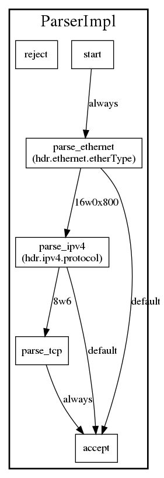

# Graphs Backend

This backend produces visual representations of a P4 program as dot files. For
now it only supports the generation of graphs for top-level control and parser blocks.

## Dependencies

In addition to other p4c dependencies, this backend requires the Boost graph
headers. On a Debian system, they can be installed with `sudo apt-get install
libboost-graph-dev`.

## Usage

```
mkdir out
p4c-graphs <prog.p4> --graphs-dir out
cd out
dot <name>.dot -Tpng > <name>.png
```

## Example

Here is the graph generated for the ingress control block of the
[flowlet_switching-bmv2.p4](../../testdata/p4_16_samples/flowlet_switching-bmv2.p4)
test program:


Here is the graph generated for the parser block of the
[flowlet_switching-bmv2.p4](../../testdata/p4_16_samples/flowlet_switching-bmv2.p4)
test program:



For a more complex example, you can look at the control graph generated for the
egress control of
[switch.p4](https://github.com/p4lang/switch/tree/f219b4f4e25c2db581f3b91c8da94a7c3ac701a7/p4src)
[here](http://bmv2.org/switch_egress.png).
