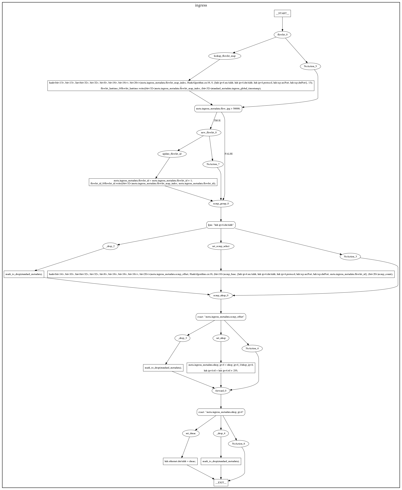
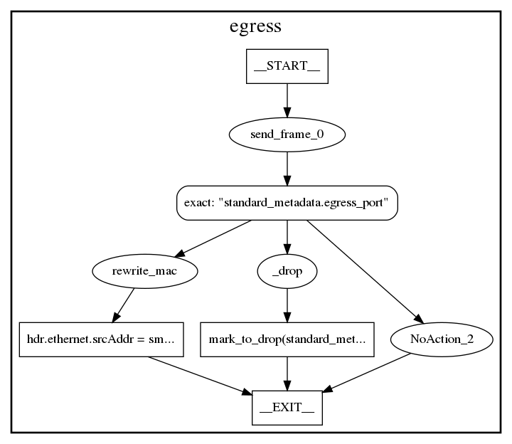

# Graphs Backend

This backend produces visual representations of a P4 program as dot files. For
now it supports the generation of graphs for top-level control and parser blocks,
generation of fullGraph, which merges graphs for top-level program blocks and
json representation of fullGraph.

dot files can be processed by the `dot` command from
[Graphviz](http://graphviz.org), which can lay out the nodes and
edges of the graphs and write the result in many different graphical
file formats.

## Dependencies

In addition to other p4c dependencies, this backend requires the Boost graph
headers. On a Debian system, they can be installed with `sudo apt-get install
libboost-graph-dev`.

## Usage

```
mkdir out
p4c-graphs <prog.p4> --graphs-dir out
cd out
dot <name>.dot -Tpng > <name>.png
```

For generation of dot fullGraph, use option `--fullGraph` and 
for generation of fullGraph represented in json, use option `--jsonOut`.

## Format of json output

Output in json format is an object with fields:

- `info` (object)

    - `name` - Filename of P4 program.
    
- `nodes` (array) - Contains objects, representing program blocks.

    - `type` - Type of program block. Valid values are "parser" and "control".
    
    - `name` - Name of program block.
    
    - `nodes` (array) - Contains object, representing nodes of CFG.
    
        - `node_nmb` - Index of given object in array nodes.
        
        - `name` - Node label.
        
        - `type` - Type of node.
        
        - `type_enum` - Enum value, representing type of node in backend *p4c-graphs*. 
        
    - `transitions` (array) - Contains objects, representing transitions between nodes in `nodes`.
    
        - `from` - Index to node in `nodes`, from which edge starts.
        
        - `to` - Index to node in `nodes`, in which edge ends.
        
        - `cond` - Edge label.
        
Objects which represent program blocks are ordered in `nodes`, in the order in which they are defined in the main declaration of P4 program.

## Example

Here is the graph generated for the ingress control block of the
[flowlet_switching-bmv2.p4](../../testdata/p4_16_samples/flowlet_switching-bmv2.p4)
test program:



Here is the graph generated for the egress control block of the
[flowlet_switching-bmv2.p4](../../testdata/p4_16_samples/flowlet_switching-bmv2.p4)
test program:



Here is the graph generated for the parser block of the
[flowlet_switching-bmv2.p4](../../testdata/p4_16_samples/flowlet_switching-bmv2.p4)
test program:


Examples of generated fullGraph for [flowlet_switching-bmv2.p4](../../testdata/p4_16_samples/flowlet_switching-bmv2.p4) program
and [firewall.p4](https://github.com/p4lang/tutorials/blob/master/exercises/firewall/solution/firewall.p4) program
can be found in [resources](resources/), also with json fullGraph.