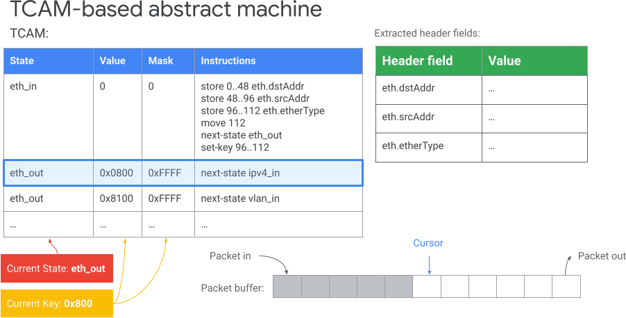
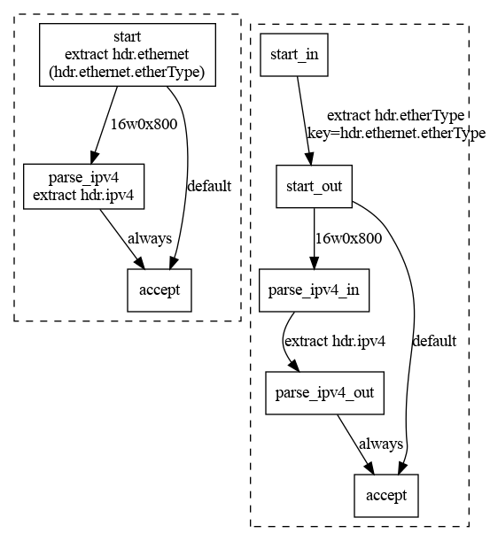

# Parser back-end for tc extensions

This back-end compiles only the parser program (currently) to a ternary content
addressable memory (TCAM)-based abstract machine, which is the most common
mechanism for realizing packet parsers in hardware today. The TCAM-based machine
is based on the ideas from [_Design Principles for Packet Parsers_ by Gibb et
al.](http://yuba.stanford.edu/~nickm/papers/ancs48-gibb.pdf) (especially Section
5 of the paper).

The goal of this back-end is to fill a gap that currently exists among P4
back-ends today. Most parser hardware is TCAM based, however all the backends
(except bpf) are architecture agnostic.

The resulting TCAM program is output as a YAML file. Each TCAM entry is
expressed using an [extended tc-flower grammar](#tc-extensions).

We have also implemented a software simulator for parsers written for the
TCAM-based abstract machine. The simulator will be open-sourced soon.

## Additional dependencies

On top of the p4c dependencies, this back-end requires:

- Abseil, following Abseil's Live at Head policy, the back-end is built and
  tested
- yaml-cpp 0.7.0

All of the dependencies are specified in the Bazel build file
(`/bazel/p4c_deps.bzl`).

## Building and testing the back-end

The back-end uses Bazel for building, in the root of the `p4c` repository, you
can use the following command to build the test programs and the compiler:

```bash
bazel build //back-ends/tc/...
```

Then, the compiler with this back-end will be available under
`bazel-bin/back-ends/tc/p4c_tc`.

To run the unit tests, use the command

```bash
bazel test //back-ends/tc/...
```

## Command line invocation

The driver `p4c_tc` supports the common set of options other back-ends also
support, including `--fromJSON` to read from a P4 IR file. In addition, the
back-end supports the following options:

- `-o outfile`: The compiler writes the YAML output to `outfile` instead of
  standard output.
- `--dump-tc-commands`: The compiler writes the `tc` commands in an unstructured
  way to the standard output, so they can be pasted into a shell (even when the
  `-o` flag is given).

## The TCAM-based abstract machine

A Ternary Content Addressable Memory (TCAM) is a hardware look-up table with a
"don't care" option for some of the bits. Because of the "don't care" bits, a
value may match multiple entries during a look-up, in this case the TCAM picks
the match with the longest prefix. These values the TCAM matches over are called
**keys**. TCAMs are used in hardware to quickly look up information, so
designing the packet parsers around a TCAM can lead to efficient
implementations.

The TCAM-based abstract machine is the compilation target, and it is based on
the ideas from [_Design Principles for Packet Parsers_ by Gibb et
al.](http://yuba.stanford.edu/~nickm/papers/ancs48-gibb.pdf) on efficient packet
parsers in hardware. The abstract machine is modeled as a state machine with the
following components:

- A finite set of states
    - There is a special start state which the abstract machine starts in, along
      with a 0-bit key. This state is named `start` following the P4 convention.
    - There are two other special states indicating parser success and failure
      respectively: `accept` and `reject`. A packet is successfully parsed if
      the parser reaches the `accept` state, and it is rejected by the parser if
      the parser reaches the `reject` state. If the parser does not reach either
      state by the end of the input, then the packet is deemed too short and
      rejected.
- A packet buffer holding the packet data to parse.
- A cursor indicating how many bits of the packet have been consumed by the
  parser.
- Two registers:
  - A _current state_ register keeping track of the current state the abstract
    machine is in.
  - A _current key_ register keeping track of the current key read from the
    packet buffer. An implementation of the abstract machine can keep track of
    the offsets relative to the cursor in this register rather than copying a
    value from the packet buffer.
- A TCAM mapping the current state and the current key to which instructions (in
  [a custom instruction set](#instructions)) to execute . Conceptually, a TCAM
  entry maps `(state, value, mask)` to a sequence of instructions. A TCAM entry
  matches the current state and the current key if `state == current_state &&
  (key & mask) == value &&& mask` (here, `&&` is logical and, and `&&&` is bit
  masking as used in P4).
- A write-only key-value store for the extracted header fields. This is a
  mapping from each header field (such as `ethernet.etherType`) to the extracted
  value.
- Definitions of header types and header instances the parser extracts from the
  packet. These definitions maintain only the sizes and the order of header
  fields to make them available to `tc` matchers later on. They are not
  necessary for the operation of the abstract machine.

Visually, the components of the TCAM-based machine are as follows:



In the diagram above, the current state is `eth_out` and the current key is
`0x0800` (EtherType of IPv4 packets) so the abstract machine loads the
instructions for the highlighted entry, which causes the machine to switch to
state `ipv4_in`. The instructions of the abstract machine are described in the
following section.

### Instructions

The abstract machine is rather spartan in terms of the instructions it
supports. There are only 4 available instructions:

- `move <N>`: Move the cursor by `N` bits. Here, `N` is non-negative to prevent
  backtracking.
- `set-next-state <State>`: Update the current state register to `State`.
- `store <x>..<y> <Header Field>`: Set the value of `Header Field` in the
  write-only store to `packet_buffer[cursor+x..cursor+y]`, and mark Header Field
  as extracted (so the match actions can query if Header is
  available/extracted). If Header Field already had a previous value, overwrite
  it. Example: `store 4..11 ipv4_inner.tos`
- `set-key <x>..<y>`: Update the current key register to contain the value
  `packet_buffer[cursor+x..cursor+y]`.

A note about notation: All the ranges over packet buffer are indexed 0-based,
and the range `x[a..b]` is inclusive on the left-hand side and exclusive on the
right-hand side, so it corresponds to `x[a],x[a+1],x[a+2],...,x[b-1]`. For
example, `packet_buffer[0..4]` corresponds to the first 4 bits of the packet
buffer: `packet_buffer[0],packet_buffer[1],packet_buffer[2],packet_buffer[3]`.

### The execution model of the abstract machine

The abstract machine fetches the instructions for the current state, executes
them potentially in parallel, and then updates the state. So, none of the
instructions' side effects are visible until all instructions are executed and
all instructions for the same TCAM entry observe the same machine
configuration. This execution model allows the hardware implementations that can
map multiple abstract machine instructions into a single hardware instruction.
Effectively, the abstract machine is executing the following algorithm:

```
currentState=start
currentKey=0w0 // A 0-bit key
while currentState not in {accept, reject}:
  instructions = lookup(currentState, currentKey)
  for instruction in instructions:
    run the instruction on (currentState, currentKey, currentCursor), save the side effect
  update currentState, currentKey, cursor, header fields according to the collected side effects
```

Here, `lookup` performs a longest-prefix matching lookup among the TCAM entries
that match the current state and the current key.

## The architecture of this back-end

This back-end uses a representation of programs for the TCAM-based abstract
machine (described in the previous section) as its own intermediate
representation. The TCAM programs consist of header definitions and a TCAM table
mapping states, values, and masks to sequences of instructions.

The back-end is organized in 3 stages:

1. A translation layer from P4 IR to a TCAM program. This stage is implemented
   in `IRBuilder` (`ir_builder.cpp`) as a visitor over P4 IR. This visitor
   extracts the header definitions for the headers used in the parser, and
   traverses the parser states to generate TCAM entries.
2. A middle-end (separate from P4's middle-end) that optimizes the TCAM
   programs. The optimizations are specific to the issues created by the
   translation, and mismatches between the TCAM programs and the P4 parsers in
   terms of state transitions. This middle end is implemented as a series of
   `AnalysisPass` and `TransformPass` instances (`pass.h`) mediated by
   `PassManager` (`pass_manager.cpp`). The details of this middle end are
   covered in a later section.
3. An output layer that creates a YAML file containing the TCAM machine
   description as a series of `tc` commands that can be parsed easily
   (`yaml_serialization.cpp`). The back-end also contains a YAML loading module
   (`yaml_parser.cpp`) that allows modifying the TCAM programs outside of the
   compiler then optimizing them using the compiler (the CLI option for loading
   a YAML program is not implemented yet). YAML is chosen because it is
   human-readable, it allows comments, and it is structured enough to be parsed
   easily by the compiler or a consumer of the programs such as a simulator.

### Code organization

The code is organized as follows (if a `.h` file is given, then the `.cpp` file
contains the corresponding implementation):

- `p4c_tc.cpp` contains the driver and the main entry point for this back-end.
- `tcam_program.h` contains the central data structure for the back-end: the TCAM
  program representation.
- `instruction.h` contains the 4 instructions the back-end supports, along with
  some commonly-used methods for them.
- `util.h` contains general utility functions including the representation for
  ranges (`Range` class) and the functions for parsing/outputting bit strings.
- `p4c_interface.h` contains the interface between the driver and the `p4c`
  front-end. It is separated as a module so the compiler can be invoked in some
  of the tests.
- `pass.h` and `pass_manager.h` contain the infrastructure for managing analysis
  and transformation passes. Currently, the following passes are implemented:
  - `inlining.h` implements inlining.
  - `reachability.h` implements reachability analysis and call graph
    construction using the existing call graph analysis in p4c's front-end.
  - `dead_state_elimination.h` removes unreachable states.
- `yaml_parser.h` and `yaml_serializer.h` handle converting TCAM programs
  from/to the YAML representation.
- `simulator.h` contains the parser simulator that loads a TCAM program and
  parses a given packet buffer.
- `test_util.h` contains the utility functions used only for testing.
- All files ending with `_test.cpp` are tests for a particular feature or module
  (for example, `util_test.cpp` tests the `util` module, and
  `lookahead_test.cpp` tests the support for `parser.lookahead`). The tests use
  GoogleTest.

### Translating the parser states

The P4 parser states extract a header, then switch on an extracted value (the
choices are expressed as the out-edges of the parse graph) but the switching on
the extracted value happens when entering a state according to [the TCAM
machine's execution model](#the-execution-model-of-the-abstract-machine) because
that is when the machine chooses which entry to load (so the choices are
expressed as in-edges in the state transition diagram). To resolve this
mismatch, `IRBuilder` translates each state to an in-state and an out-state,
where the in-state is responsible for extracting headers and setting keys for
the match, and the out-state is responsible for selecting which next in-state to
go to. As an example, the parser described by the diagram on the left is
translated to the parser described by the diagram on the right:



This translation results in redundant states that can be inlined into the caller
state, the optimization passes perform this inlining and clean-up the unused
states.


### Pass manager architecture and potential future merging with the P4 IR `PassManager`

The pass manager records a sequence of transformation passes, and executes them
in order. Currently, if a transformation pass fails the pass manager aborts but
maintains the result of the latest successful transformation. The transformation
passes create new programs so that TCAM programs are immutable inputs and
analyses (results of analysis passes) can be computed and cached on-demand in
the middle of a transformation pass. The pass manager also maintains a cache for
analysis results that is evicted when a new transformation pass begins. There is
also a rudimentary infrastructure for backtracking in the future.

The existing `PassManager` in the P4 mid-end also supports similar features
along with a more extensive backtracking support. However, it is implemented as
a visitor, and its implementation is tightly coupled with the P4 IR. In the
future, the more general parts of the pass manager handling backtracking,
caching and planning the execution of passes can be decoupled from the parts
specific to running P4 IR transformations to reuse code between the two pass
managers.

## Restrictions on the input programs

This back-end currently compiles only the parser, and ignores the control
structures in the input P4 program. The back-end supports parsers with the
following restrictions:

- Only `packet.lookahead` and `packet.extract` methods are supported.
- There is a rudimentary support for local variables and assignment to support
  `packet.lookahead`. Variables can hold only data extracted from the packet
  buffer.
- State transitions can _select_ only on the values that are read from the packed
  buffer in this state. This restriction stems from the target not supporting
  look-behinds.
- The parsers are assumed to be loop-free.
- Only sized types are allowed in headers.

## Future work

This section outlines planned future work to extend this backend. Everyone is
also invited to participate in discussions/help with implementation in these
areas!

### Extract optimization

Once this back-end is extended to be aware of the specific match-action rules
(supporting also the control blocks), the parser can be optimized to remove
extraction of headers and fields that are not used by the rest of the
pipeline. This optimization can be implemented using a variant of live variable
analysis and dead code elimination.

### Constraint-based entry generation

Some hardware implementations of the TCAM abstract machine may have certain
limitations such as key size, number of instructions in an entry, or instruction
mix. We can implement a series of transformation passes that can break down the
entries to satisfy these requirements.

### Register support

Currently, the back-end specifically requires all data to be encoded in the
state itself or read from the packet buffer. To allow more efficient
implementations, we may support persisting values across states by adding
additional registers that can be set or used.

### Multi-stage TCAM implementations

Large TCAMs are expensive, so some hardware realizes parsers by connecting
smaller TCAMs serially. Such an architecture limits the depth of the parse graph
based on the TCAM sizes. Compiler support for these architectures would require
partitioning the parser to multiple TCAMs automatically, and every TCAM entry to
carry an attribute of the stage number.

## tc extensions

The extensions to `tc` that the back-end targets are as follows:

### Packet header declarations

We separate the declaration of header types and the header instances that are
going to be populated by the parser, similarly to P4. The headers have a flat
structure, so we inline structs and headers in a header type declaration so that
we only need to specify the bit widths of each field. Because we need to specify
the bit widths of each field, all fields in a header must have a fixed size. The
header declaration format is as follows:

```
tc declare-header <header-type-name> <field>:<width>...
```

Here, the field names can contain dots, because we flatten them. For example,
the header type declarations for Ethernet and VLAN packet headers would be:

```
tc declare-header eth_t dstAddr:48 srcAddr:48 etherType:16
tc declare-header vlan_t tci.pcp:3 tci.dei:1 tci.vlan_id:12 etherType:16
```

Note that the nested structures such as tag control information (`tci`) are
inlined into `vlan_t` to keep the header fields as only bitstrings.  After
declaring a header type, we can instantiate headers with that type (this is
similar to having instances in a `headers` struct in P4):

```
tc add-header-instance <header> type <header-type-name>
```

For example, the following commands declare one header instance of each type:

```
tc add-header-instance eth type eth_t
tc add-header-instance vlan type vlan_t
```

### Parser state transition declarations

We propose a language for describing how to populate the TCAM entries and
sequence of instructions according to the section A hardware-friendly packet
parser abstract machine. For each state, and each transition to that state, we
should have a declaration of instructions to execute:

```
tc add-transition <state> <value> <mask> <instruction-list>
```

The command above adds a TCAM entry, and adds state to the state set if it
hasn’t been added to it. The instructions are defined using BNF as follows, and
their semantics are given in the [Instructions](#instructions) section:

```
<instruction-list> ::= <instruction-list> <instruction> | <instruction-list>
<instruction> ::= "move" <number>
  | "set-next-state" <state>
  | "store" <number> ".." <number> <header-field>
  | "set-key" <number> ".." <number>
```

All of the numbers above are nonnegative. The state names can contain
alphanumeric characters, and underscore _. The header fields can contain
alphanumeric characters, underscore `_`, and dot `.`. Note that `.` is part of
the header field, so for example `ipv4.ttl` is parsed as a single header field
token.

To allow efficient hardware implementations using look-up tables that fetch data
in byte boundaries, we require that actions in a state move the cursor by a
byte-sized (i.e., divisible by 8) offset. The compiler is going to check this
constraint when generating the transitions from a state, and issue a warning if
the instructions for a state move the cursor by a non-byte-sized amount. For
example, the following set of instructions is valid because the cursor moves by
16 bits total, which is byte-sized (2 bytes) even though none of the single move
instructions has a byte-sized argument:

```
store 0..3 vlan.tci.pcp
move 3
store 3..4 vlan.tci.dei
move 1
store 4..16 vlan.tci.vlan_id
move 12
```

However, the following sequence of instructions is invalid because the cursor
moves by 15 bits total, which is not byte-sized:

```
store 0..3 vlan.tci.pcp
move 3
store 4..16 vlan.tci.vlan_id
move 12
```

The transitions described above first match a state and a key, then execute the
instructions. This is due to how the TCAM-based machine works.

### Extending `tc-flower`’s match language with arbitrary headers

The extension described here is not used by the compiler, but it demonstrates
how the parsers and the headers the back-end generates are used by matchers in
`tc`.

`tc-flower` defines a long list of matches, and uses [the following
syntax](https://man7.org/linux/man-pages/man8/tc-flower.8.html):

```
tc filter … flower [ MATCH_LIST ] [ action ACTION_SPEC ] …
```

The linked page defines the existing matchers, and `MATCH_LIST` is a sequence of
matchers. We propose adding an additional matcher defined as follows:

```
MATCH ::= … | header HEADER_FIELD MASKED_VALUE
MASKED_VALUE ::= NUMBER | NUMBER &&& MASK
```

where `HEADER_FIELD` is a field of a declared header, `NUMBER` and `MASK` are
numbers with a width specifier, `XwN` is a number with value N and width X (same
as the notation P4 uses). N can be specified in decimal or hexadecimal. The tc
frontend can also support other schemes already supported by tc flower such as
the LLADDR format or the slash notation for specifying the mask.

The header matcher matches a packet when:
 - The packet is successfully parsed.
 - The `HEADER_FIELD` is marked as available

## Parser simulator

The `ParserSimulator` class defined in `simulator.h` loads a TCAM program (which
can be parsed from YAML). Currently, the simulator is just a library.
`simulator_test.cpp` shows how to load a TCAM program from YAML, and how to
invoke the parser. `test_util.h` contains some helper functions for creating the
packet buffer (bitvector) the simulator expects from a pair of `char` iterators,
so the packet can be loaded from a `std::string` or a `std::vector`. The helper
copies over the packet data to the bitvector representation.
