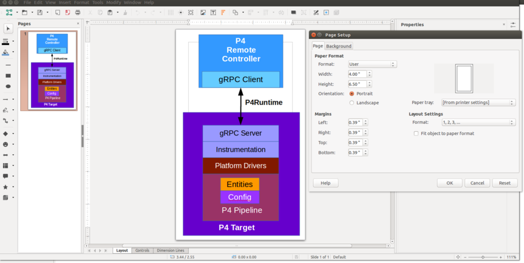

# P4Runtime specification documents

## Writing Madoko content

Please refer to the [Madoko documentation](http://madoko.org/reference.html) and
this FAQ.

### FAQ

#### Should I wrap lines in the Madoko source files?

Yes, at 80 charcters.

#### How to write nested numbered lists in Madoko?

It's easy but you cannot us x.y.z. to number the nested items otherwise it won't
render properly. Instead use a single number for all items and make sure you
indent each nested level with 4 spaces:
```
1. aaa1
    1. aaa11
        1. aaa111
        2. aaa112
    2. aaa12
        1. aaa121
...
```

#### When to use Madoko tables?

Madoko tables are pretty limited. In particular, according to the documentation,
"Every row can be on one line only". Tables tend to render pretty well in HTML,
but not in PDF: by default it seems that text inside a cell never gets
wrapped. There may be a solution to this, but to avoid having to deal with Tex
directly too much, we tend to use lists instead.

#### What determines how code blocks are rendered?

Quite a few thing actually.

The `pre, code` metadata rule sets some defaults for all code blocks, such as
font family and size. See
[here](http://madoko.org/reference.html#sec-css-font-family).

We also use some CSS rules in the metadata section to customize the behavior of
the syntax highlighter. See
[here](http://madoko.org/reference.html#sec-advanced--customizing-highlight-colors).
For example:
```
.token.keyword    {
    font-weight: bold;
}
```

We use custom syntax highlighters for C++, P4, Protobuf and Protobuf text
messages. For each of these we have a JSON file (e.g. `p4.json`). They are
"imported" through the `Colorizer` metadata key:
```
Colorizer: p4
Colorizer: proto
Colorizer: prototext
Colorizer: cpp
```
The name of the language can be specified when introducing a code block:
````
```<language>
...code...
```
````
See
[here](http://madoko.org/reference.html#sec-advanced--custom-syntax-highlighting)
for more information.

Finally, to facilitate the definition of code blocks, we use [replacement
rules](http://madoko.org/reference.html#sec-replace) for each language:
```
p4example {
  replace: "~ Begin P4ExampleBlock&nl;\
                 ````p4&nl;&source;&nl;````&nl;\
                 ~ End P4ExampleBlock";
  padding:6pt;
  margin-top: 6pt;
  margin-bottom: 6pt;
  border: solid;
  background-color: #ffffdd;
  border-width: 0.5pt;
}
```
This enables us to define additional properties which will be applied to every
"p4" code block (e.g. background color). Defining a new P4 code block becomes
very easy:
```
~ Begin P4Example
header PacketOut_t {
  bit<9> egress_port;
  bit<8> queue_id;
}
~ End P4Example
```
It seems that when defining the replacement rule, the name of the rule and the
name of the block tag have to match, but the case doesn't matter (`p4example`
and `P4Example`).

#### Comments on Tex Header

We have the following in Tex Header:
```
\setlength{\emergencystretch}{2em}
```
Without this, lines which include inline code tended to spill into the
right-side margin (we do have some long names in P4Runtime) since `\texttt` does
not allow hyphenation. Even after enabling hyphenation (see
[StackExchange](https://tex.stackexchange.com/a/44362)), we were still seeing
the same issue (except when setting the `font-size` to 100% instead of 75% for
some reason). By setting `emergencystretch` we give Tex the option to do an
extra pass when trying to fit an overfull box. See
[StackExchange](https://tex.stackexchange.com/a/241355) for more
information. Not sure what the "optimal" setting is.

### bibref_no_title.js

It is a jQuery script that removes the `title` attribute for bibliography
links. The title is not correct when the BibTeX title includes inline math and
also contains "n.d." (for "no date") which is confusing for inline references.

#### List formatting

Indent each line in such a way that text is aligned for each bullet point:
```
1. aaaa
   bbbb
   cccc
```
or
```
* aaaa
  bbbb
```

#### Inline code with backticks

Use backticks for:

* names of Protobuf messages / fields / RPCs / enum symbols
* P4 code
* name of variables when describing examples (pseudo-code or P4)

Do not use backticks for:

* PSA extern names
* "P4Runtime" & "P4Info"

#### What to capitalize?

* "Protobuf"
* Each significant word in a heading / section name
* PSA extern names

#### Hexadecimal numbers

We use lowercase for the letter digits when writing hexadecimal numbers. This is
a very arbitrary decision, purely for the sake of uniformity. Maybe lowercase
letters are easier to type for most people?

### Hyphen, en dash and em dash

Use `-` for the hyphen, `--` for en dash and `---` for em dash. You can refer to
this [section of the Madoko
spec](http://madoko.org/reference.html#sec-smart-quotes-symbols-and-direct-links).

## Document Figures
Each image in the specification has a corresponding `.odg` file under
`assets/`. These are LibreOffice drawing files. The files are rendered into
`.svg` and `.png` images (for HTML and PDF output, resepectively) at build time,
using the `soffice` command-line tool. The page size for each image should be
adjusted manually by the author ("artist") to just fit the image on the
apparrent "page," to minimize padding around the image in the rendered
document. Use the menu item `Format | Page/Size Properties.` See the example
screen shot below. (Do not check the "Fit object to paper format" box - it will
change the object's aspect ratio.)


## CI upload of built documents

Travis takes care of uploading the built HTML version of the spec to AWS S3. The
latest working draft (master branch) can be found
[here](https://s3-us-west-2.amazonaws.com/p4runtime/docs/master/P4Runtime-Spec.html).

Additionally, you can access the HTML & PDF versions of the spec for any given
branch of this repository by using the following URLs:
* `https://s3-us-west-2.amazonaws.com/p4runtime/travis/<your_branch_name>/P4Runtime-Spec.html`
  for the **HTML** version
* `https://s3-us-west-2.amazonaws.com/p4runtime/travis/<your_branch_name>/P4Runtime-Spec.pdf`
  for the **PDF** version

Unfortunately, because of how Travis encrypts environment variables (which are
required to upload documents to S3), this does not work for branches in forked
repositories, even for opened pull requests.
